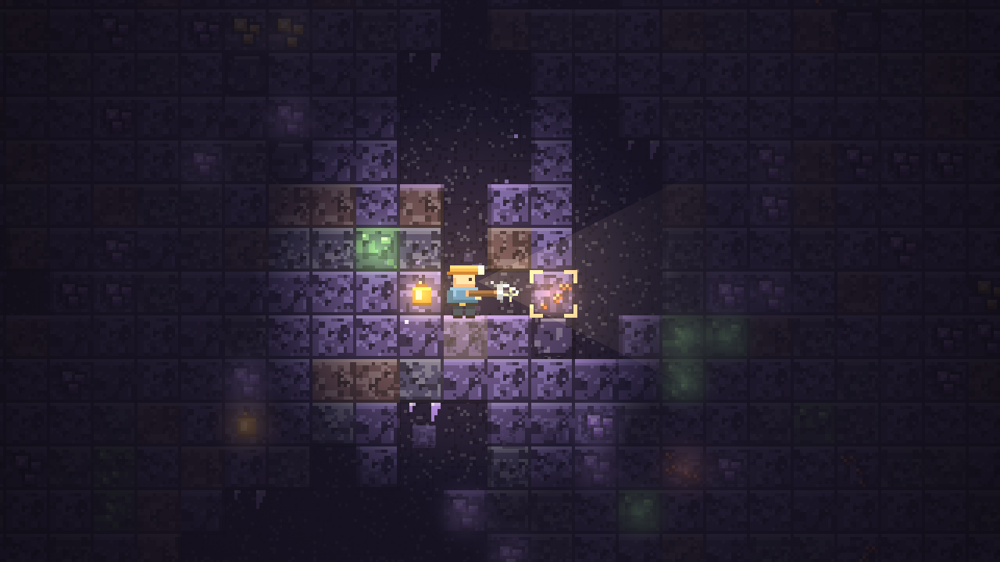
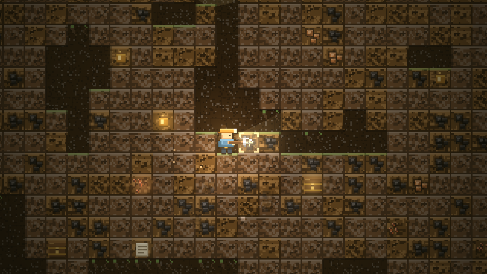
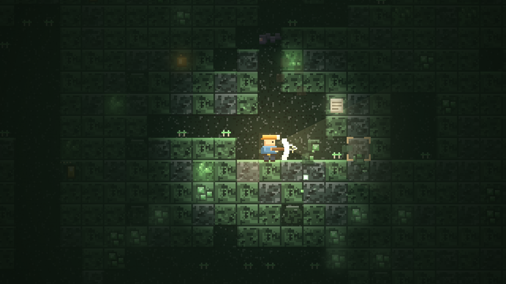
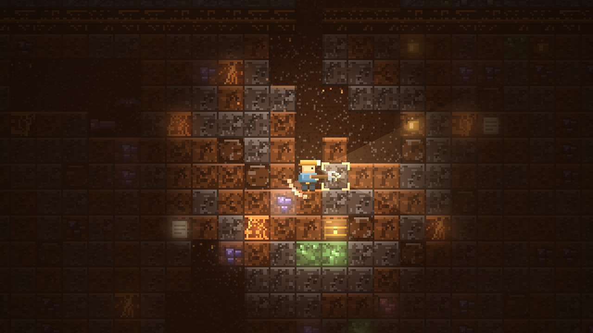
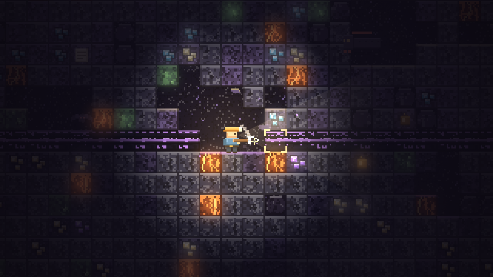

# Lanterndeep

A cozy mining roguelite about your grandfather's abandoned shaft — dig, follow the veins,
and get back up before the lantern dies.

**One HTML file. No engine, no build step, no dependencies.** Every texture, sprite, sound
and note you see or hear is generated in code at runtime.

▶ **[Play in your browser](https://mertyloo.github.io/lanterndeep/)** · 💾 [Desktop build](#desktop-build)



---

## The idea

Elias Kane sank the shaft alone in 1974, went down one morning and never came back up.
The bank wants the note paid and the family owns nothing but that hole in the hill,
so you take his lantern and his pick and start digging.

There is **no health bar and no death**. The lantern runs on energy; energy is your only
clock. Hazards cost you seconds, not lives, and when it hits zero the rope hauls you up
automatically with everything you mined still in your pack. The creatures down there do not
kill you either — they **steal your ore and run**. Chase one down and you get it back;
let it escape and it is gone.

## Features

- **Eight layers**, each with its own palette, ore table, hazards, ambience and music key —
  Green Earth, Stonebed, Crystal Hollow, Fungal Forest, The Frostrift, Emberwell,
  Ancient Ruins and Rock Bottom. Every layer is sealed behind a crust gate you have to break.
- **Swing-based mining** with a combo system: chain blocks to swing faster and earn more,
  hit 25 and the pick catches fire (Frenzy).
- **Directional aiming** — the cursor gives a direction and the game targets the first block
  that way, so you can mine comfortably while running.
- **Thieves, not monsters**: Rock Worms, Cave Bats and the Ancient Warden rob you and flee.
- **Dynamite, chests, geodes, oil flasks, powder veins and hidden rooms.**
- **19-node skill tree** (96 levels), 8 hidden relics with permanent passives,
  12 collectible journal pages that tell the grandfather's descent, 14 achievements,
  rotating contracts, and an ending at 1000 m.
- Procedural pixel-art world, per-layer lighting, film grain, screen shake, hitstop,
  and a generative pentatonic soundtrack that gets busier as your combo grows.

## Screenshots

| Green Earth | Fungal Forest |
|---|---|
|  |  |

| Emberwell | Rock Bottom |
|---|---|
|  |  |

## Controls

| Input | Action |
|---|---|
| **Mouse** | Point in a direction — the first block that way gets mined. Creatures under the cursor take priority. |
| **Right click** | Drop dynamite |
| **A / D** | Walk (single-block steps are climbed automatically) |
| **W / Space** | Jump; chimney-climb when both sides are walls |
| **S** | Climb down |
| **H** | Hot soup (+40s energy) |
| **Q** | Pull the rope and haul up |
| **Esc** | Pause · **M** mute · **F11** fullscreen |

## Running it

Clone the repository and open `index.html` in any modern browser. That is the whole setup.

```bash
git clone https://github.com/mertyloo/lanterndeep.git
cd lanterndeep
start index.html      # Windows  (macOS: open index.html)
```

### Desktop build

`desktop/build/MAKE EXE - double click.bat` packages the game into a standalone Windows
application with Electron (downloads the runtime on first run, no Node.js required) and
drops a shortcut on your desktop. `desktop/Lanterndeep (browser launcher).bat` is the
lightweight alternative: it opens the game in a chromeless browser window.

## How it is built

Everything lives in `index.html` — roughly 4,000 lines of vanilla JavaScript, HTML and CSS.

- **Rendering**: 2D canvas at an integer pixel-art zoom that adapts to the screen. Tile,
  ore, decoration and character textures are drawn procedurally into offscreen canvases at
  startup and cached, so the game ships with zero image assets.
- **Lighting**: a radial darkness pass tinted with the current layer's palette, an additive
  lantern glow and headlamp cone, plus per-ore bloom so veins twinkle in the dark.
- **World**: value-noise caves, blob-noise ore veins, deterministic rooms, layer gates and
  rare set pieces, all generated on demand row by row from a seeded PRNG.
- **Audio**: no audio files. Every sound is synthesised with WebAudio — filtered noise bursts
  for pick strikes, arpeggios keyed to ore type, a convolution reverb built from decaying
  noise, and a generative music layer whose density follows the combo meter.
- **UI**: the whole interface lives in a fixed design-resolution layer that is scaled to the
  window with one transform, so it looks identical from 1280×800 up to 4K.
- **Saving**: `localStorage`, with migration from older save formats.

## Project structure

```
index.html                      the entire game
desktop/                        launcher + Electron packaging scripts
docs/design-notes.md            design and balance notes
docs/screenshots/               screenshots used in this README
```

## License

MIT — see [LICENSE](LICENSE).

---

Made by **Merthan Keleş** ([@mertyloo](https://github.com/mertyloo)).
Inspired by *Rock Bottom* and *Keep on Mining!*
